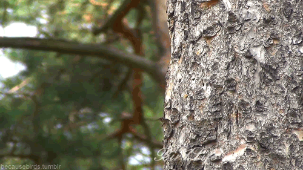

# Sounds of Nature (in progress)
Welcome to the Sounds of Nature Github repository! This project aims to use supervised and unsupervised learning methods to develop a processing chain in Python for the analysis of acoustic landscapes and animal sound emissions. The project has two main components: characterization of acoustic landscapes and species recognition. We hope this repository will be a useful resource for researchers and practitioners interested in integrative monitoring of the environment and biodiversity using soundscapes.

  

## Repository description

This repository provides a lot of code and data to handle different project tasks. You can find codes to process audio data, codes to classify data and so on. The following describes the purpose of the different files in the repository:
 - ./code/
	 - [create_indices_dataset.ipynb](https://github.com/amarmeddahi/sounds-of-nature/blob/main/code/create_indices_dataset.ipynb "create_indices_dataset.ipynb") -> creates a representation of over 60 acoustic indices from raw audio data
   - [create_latent_dataset.ipynb](https://github.com/amarmeddahi/sounds-of-nature/blob/main/code/create_latent_dataset.ipynb "create_latent_dataset.ipynb") -> creates a latent representation of various dimensions from raw audio data
 - ./data/
	 - [indices.csv](https://github.com/amarmeddahi/sounds-of-nature/blob/main/data/indices.csv "indices.csv") -> representation by acoustic indices of more than 60 hours of labeled audio for 4 classes
	 - [latent_space_mel128_512.csv](https://github.com/amarmeddahi/sounds-of-nature/blob/main/data/latent_space_mel128_512.csv "latent_space_mel128_512.csv") -> representation by latent space (dim=512) of more than 60 hours of labeled audio for 4 classes
	 - [regression.csv](https://github.com/amarmeddahi/sounds-of-nature/blob/main/data/regression.csv "regression.csv") -> regression data for the prediction of environmental variables 
	 - [regression_variables.txt](https://github.com/amarmeddahi/sounds-of-nature/blob/main/data/regression_variables.txt "regression_variables.txt") -> explain the significance of the different variables in [regression.csv](https://github.com/amarmeddahi/sounds-of-nature/blob/main/data/regression.csv "regression.csv")
	 - [reg-ind_joint_table.csv](https://github.com/amarmeddahi/sounds-of-nature/blob/main/data/reg-ind_joint_table.csv "reg-ind_joint_table.csv") -> joint table to easily predict the regression variables

## References
Sounds of Nature communicates with and/or references the following:

 - scikit‐maad: https://github.com/scikit-maad/scikit-maad
 - openl3: https://github.com/marl/openl3
 
We thank all their contributors and maintainers!
